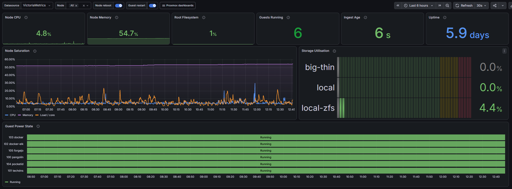
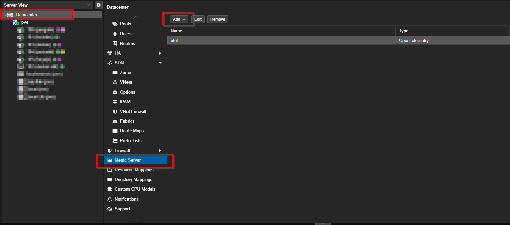
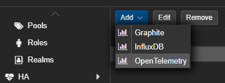
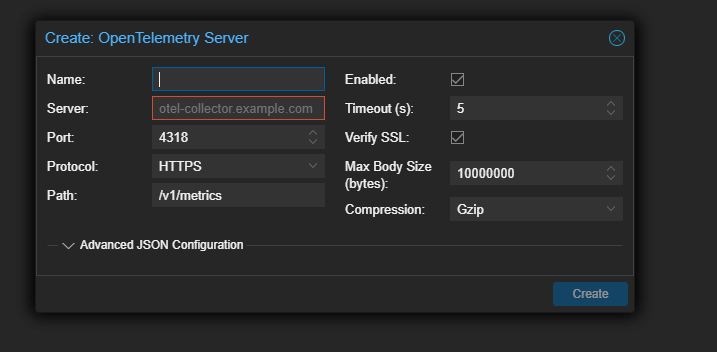
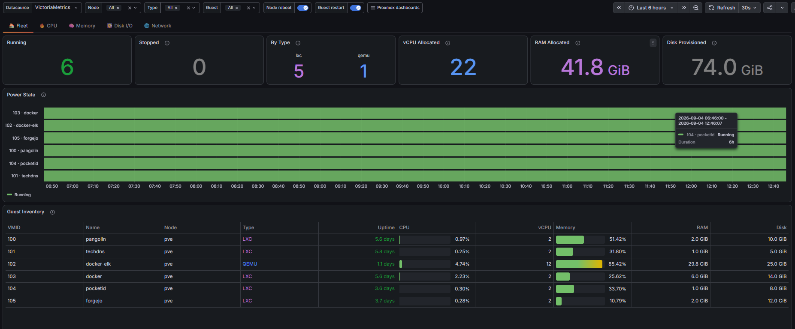
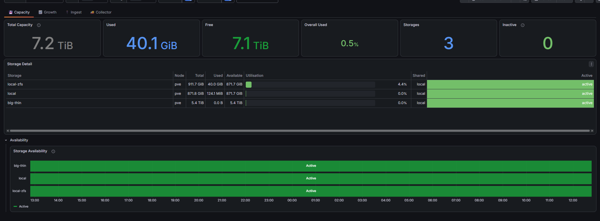

# Proxmox VE monitoring with Grafana

This project gives you a ready-to-use Proxmox monitoring stack:

- Proxmox sends metrics with its built-in OpenTelemetry integration.
- OpenTelemetry Collector receives and forwards the metrics.
- VictoriaMetrics stores them.
- Grafana starts with the VictoriaMetrics datasource and all five dashboards already installed.

You do **not** need to import dashboards or create a datasource by hand.



## Before you start

You need:

- a Linux computer or VM with Docker Engine and the Docker Compose plugin;
- the IP address of that Docker host, for example `192.168.1.50`;
- a Proxmox account that can change Datacenter metric-server settings;
- TCP port `4318` open from every Proxmox node to the Docker host; and
- TCP port `3000` open from your trusted LAN to the Docker host.

Do not expose ports `3000` or `4318` directly to the internet.

## Step 1: Download the project

Run these commands on the Docker host:

```bash
git clone https://github.com/Unknowlars/homelab-proxmox-opentelemetry.git
cd homelab-proxmox-opentelemetry
cp deploy/.env.example deploy/.env
```

Already cloned it? Update it with:

```bash
git pull
```

## Step 2: Choose a Grafana password

Open the settings file:

```bash
nano deploy/.env
```

Replace this value with a strong password:

```dotenv
GRAFANA_PASSWORD=replace-with-a-strong-local-password
```

The included settings make Grafana available to your trusted LAN on port
`3000`. If Grafana should only be reachable from the Docker host, change
`GRAFANA_BIND_ADDRESS` to `127.0.0.1`.

## Step 3: Start everything

```bash
docker compose --env-file deploy/.env -f deploy/docker-compose.yml up -d
```

Check that all three containers are running:

```bash
docker compose --env-file deploy/.env -f deploy/docker-compose.yml ps
```

You should see `otel-collector`, `victoriametrics`, and `grafana` with a status
of `Up`.

## Step 4: Connect Proxmox

In the Proxmox web interface, select **Datacenter**, open **Metric Server**, and
click **Add**.



Choose **OpenTelemetry**.



Enter these values:

| Field | Value |
|---|---|
| Name | `otel-collector` |
| Server | Your Docker host IP, for example `192.168.1.50` |
| Port | `4318` |
| Protocol | `HTTP` |
| Path | `/v1/metrics` |
| Compression | `Gzip` |
| Timeout | `5` |
| Verify SSL | Off |

Click **Create**. This setting is shared by the whole Proxmox cluster, so add it
only once per cluster.

The dialog looks like this. The screenshot shows an HTTPS example; for the
included local Docker setup, use the HTTP values in the table above.



## Step 5: Open Grafana

Open this address in a browser, replacing `DOCKER_HOST_IP` with your host's IP:

```text
http://DOCKER_HOST_IP:3000
```

Sign in with:

- Username: `admin`
- Password: the `GRAFANA_PASSWORD` you set in `deploy/.env`

Open **Dashboards → Proxmox VE**. The datasource and these five dashboards are
created automatically:

### Overview


### Fleet Intelligence


### Guests: VM and LXC



### Node Operations


### Storage and Telemetry Pipeline



Metrics normally appear after the next Proxmox status update. Give it about one
minute, then refresh the dashboard.

## Quick checks

Check the Collector health endpoint on the Docker host:

```bash
curl -fsS http://127.0.0.1:13133
```

Check that VictoriaMetrics is ready:

```bash
curl -fsS http://127.0.0.1:8428/health
```

Check that Proxmox metrics have arrived:

```bash
curl -fsSG http://127.0.0.1:8428/api/v1/query \
  --data-urlencode 'query=count({__name__=~"proxmox_.*"})'
```

If the last result is `0`, check the Docker host IP in Proxmox and make sure
port `4318/tcp` is allowed through the Docker host firewall. Then inspect the
Collector logs:

```bash
docker compose --env-file deploy/.env -f deploy/docker-compose.yml logs --tail=100 otel-collector
```

## Updating

Your metrics and Grafana settings are stored in Docker volumes and survive
container updates.

```bash
git pull
docker compose --env-file deploy/.env -f deploy/docker-compose.yml pull
docker compose --env-file deploy/.env -f deploy/docker-compose.yml up -d
```

Grafana checks the bundled dashboard files every 30 seconds. Repository updates
therefore update the provisioned dashboards without a manual import.

## Stopping

Stop the containers without deleting saved data:

```bash
docker compose --env-file deploy/.env -f deploy/docker-compose.yml down
```

Do not add `-v` unless you intentionally want to delete all stored metrics and
Grafana data.
